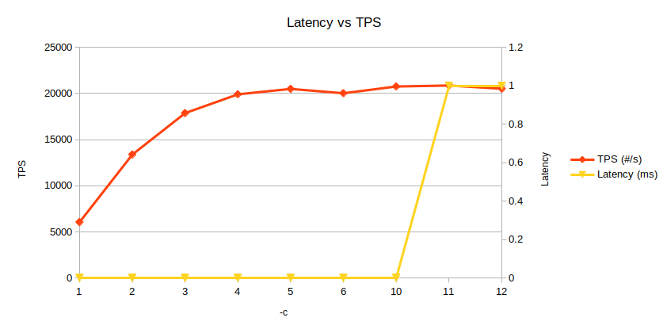

# Apache Benchmark

Autor: Sergi Gomà Cruells

## Anàlisi dels paràmetres de Apache Benchmark

*Totes les proves s'han realitzat amb un processador i7-7700k de quatre cores a 4,82 GHz.*

### Paràmetre -c

El paràmetre -c es fa servir per indicar quantes transaccions es fan a l'hora, és a dir, és un paràmetre per configurar la concurrència. Fent servir la comanda `docker run --rm jordi/ab -c 100 -n 100000 http://172.17.0.1:8080/`, faré 100.000 transaccions a un servidor aixecat amb docker, amb diversos valors de concurrència.

Aquests són els resultats:

| -c   | TPS (#/s) | Latency (ms) | CPU (%) |
| ---- | --------- | ------------ | ------- |
| 1    | 6052.8    | 0            | 39      |
| 2    | 13381.71  | 0            | 69      |
| 3    | 17875.96  | 0            | 89      |
| 4    | 19914.9   | 0            | 95      |
| 5    | 20500.2   | 0            | 96      |
| 6    | 20026.33  | 0            | 97      |
| 10   | 20763.52  | 0            | 98      |
| 11   | 20868.41  | 1            | 98      |
| 12   | 20520.28  | 1            | 98      |

Els resultats mostren que a mesura que s'incrementa la concurrència, les transaccions per segon augmenten fins que arriben a unes 20.000 aproximadament, on s'estabilitzen. Aquest punt és justament quan el nombre de transaccions concurrents coincideix amb el nombre de cores del sistema, 4. A partir d'aquí, un valor més alt de concurrència només introduirà més latència, la qual és major a 1 ms a partir de 11 transaccions concurrents. Els resultats són lògics, ja que tenint 4 cores, el més eficient és assignar un core per transacció concurrent.

Respecte al percentatge d'ús de la CPU, s'incrementa a mesura que es van fent servir més cores, fins que es fan servir els 4, on l'ús s'estabilitza prop del 100%.

### Paràmetre -k 

Aquest paràmetre serveix per habilitar la funció KeepAlive d'HTTP, que permet mantindre la connexió mentre encara estem fent transaccions al servidor, enlloc de reiniciar-la cada cop. Això comporta una millora de la eficiència, és a dir, menor latència.

