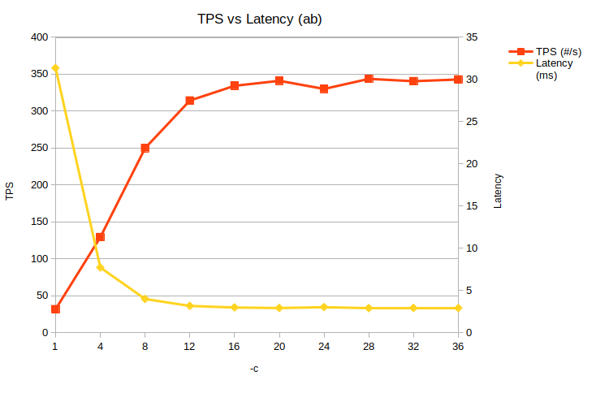

# Apache Benchmark

Autor: Sergi Gomà Cruells

## Anàlisi de la influència dels paràmetres de Apache Benchmark

*Totes les proves s'han realitzat amb un processador i7-7700k de quatre cores a 4,82 GHz.*

### Paràmetre -c

El paràmetre -c es fa servir per indicar quantes transaccions es fan a l'hora, és a dir, és un paràmetre per configurar la concurrència. Fent servir la comanda `docker run --rm jordi/ab -c 10 -n 1000 https://www.docker.com/`, faré 1000 transaccions a la web de docker, amb diversos valors de concurrència.

Aquests són els resultats:

| -c   | TPS (#/s) | Latency (ms) | CPU (%) |
| ---- | --------- | ------------ | ------- |
| 1    | 31.9      | 31.345       | 1.3     |
| 4    | 129.52    | 7.721        | 5       |
| 8    | 250.02    | 4            | 6.7     |
| 12   | 314.4     | 3.181        | 7.3     |
| 16   | 334.37    | 2.991        | 8.9     |
| 20   | 341.1     | 2.932        | 10.2    |
| 24   | 330.11    | 3.029        | 10.5    |
| 28   | 343.74    | 2.909        | 11      |
| 32   | 340.57    | 2.936        | 10.4    |
| 36   | 342.91    | 2.916        | 11.3    |

Els resultats mostren que a mesura que s'incrementa la concurrència, les transaccions per segon augmenten fins que arriben a unes 340 amb nivell de concurrència 20, on s'estabilitzen. A partir d'aquí, un valor més alt de concurrència no millora el temps d'execució. La latència es redueix quan augmentem la concurrència, però s'estanca a 3 ms al voltant de 16 transaccions concurrents. Respecte al percentatge d'ús de la CPU, s'incrementa fins a una utilització al voltant del 10%, que coincideix amb el nivell de concurrència 20 esmentat. La opció més eficient seria utilitzar una concurrència d'entre 16 i 20, per maximitzar les TPS.

### Paràmetre -k 

Aquest paràmetre serveix per habilitar la funció KeepAlive d'HTTP, que permet mantindre la connexió mentre encara estem fent transaccions al servidor, enlloc de reiniciar-la cada cop. Això comporta una millora de la eficiència, és a dir, menor latència.

## Implementació amb Go

Un cop feta la implementació amb Go, els resultats, extrets amb les mateixes condicions que a l'apartat anterior, són bastants similars a apache benchmark, amb la diferència de que les TPS arriben fins a 1100, i la latència es redueix fins a 1 ms.

Per executar-ho, només cal escriure la comanda `go run goab.go`

| -c   | TPS (#/s) | Latency (ms) |
| ---- | --------- | ------------ |
| 1    | 50.399    | 19.842       |
| 4    | 263.613   | 3.793        |
| 8    | 495.972   | 2.016        |
| 12   | 711.642   | 1.405        |
| 16   | 882.7     | 1.133        |
| 20   | 1045.719  | 0.956        |
| 24   | 1140.369  | 0.877        |
| 28   | 1066.831  | 0.937        |
| 32   | 1099.18   | 0.91         |
| 36   | 1082.407  | 0.924        |

## Servidor HTTP amb Go

El servidor es troba a l'arxiu server.go, i per executar-lo cal escriure la comanda `go run server.go` 

La gràfica mostra la mateixa tendència que en els exemples anteriors, però en aquest cas, ja que és un servidor simple i cada crida transfereix menys MB, tenim una execució més ràpida. Concretament, les TPS arriben fins a 43000, i la latència fins a 0,023 ms. Igual que en totes les proves, les dades s'estabilitzen sobre les 20 transaccions concurrents.

| -c   | TPS (#/s) | Latency (ms) |
| ---- | --------- | ------------ |
| 1    | 8591.209  | 0.116        |
| 4    | 25728.681 | 0.039        |
| 8    | 37067.419 | 0.027        |
| 12   | 38961.385 | 0.026        |
| 16   | 39958.545 | 0.025        |
| 20   | 43329.229 | 0.023        |
| 24   | 43490.847 | 0.023        |
| 28   | 42747.723 | 0.023        |
| 32   | 42661.992 | 0.023        |
| 36   | 42721.368 | 0.023        |

