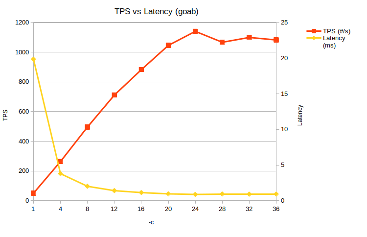

# Apache Benchmark

Autor: Sergi Gomà Cruells

## Anàlisi dels paràmetres de Apache Benchmark

*Totes les proves s'han realitzat amb un processador i7-7700k de quatre cores a 4,82 GHz.*

### Paràmetre -c

El paràmetre -c es fa servir per indicar quantes transaccions es fan a l'hora, és a dir, és un paràmetre per configurar la concurrència. Fent servir la comanda `docker run --rm jordi/ab -c 10 -n 1000 https://www.docker.com/`, faré 1.000 transaccions a la web de docker, amb diversos valors de concurrència.

Aquests són els resultats:

| -c   | TPS (#/s) | Latency (ms) | CPU (%) |
| ---- | --------- | ------------ | ------- |
| 1    | 32.94     | 30           | 1.3     |
| 4    | 132.44    | 30           | 5       |
| 8    | 250.16    | 32           | 6.7     |
| 12   | 318.8     | 37           | 7.6     |
| 16   | 332.33    | 47           | 9.6     |
| 20   | 335.42    | 59           | 10.2    |
| 24   | 340.12    | 69           | 10.5    |
| 28   | 340.74    | 80           | 11      |
| 32   | 340.09    | 92           | 10.4    |
| 36   | 340.03    | 103          | 11.3    |
| 40   | 342.11    | 114          | 11.1    |

Els resultats mostren que a mesura que s'incrementa la concurrència, les transaccions per segon augmenten fins que arriben a unes 340 amb nivell de concurrència 20, on s'estabilitzen. A partir d'aquí, un valor més alt de concurrència només introduirà més latència, sense millorar el temps d'execució. Respecte al percentatge d'ús de la CPU, s'incrementa fins a una utilització al voltant del 10%, que coincideix amb el nivell de concurrència 20 esmentat. La opció més eficient seria utilitzar una concurrència d'entre 16 i 20, per maximitzar les TPS sense perdre molts temps de latència.

### Paràmetre -k 

Aquest paràmetre serveix per habilitar la funció KeepAlive d'HTTP, que permet mantindre la connexió mentre encara estem fent transaccions al servidor, enlloc de reiniciar-la cada cop. Això comporta una millora de la eficiència, és a dir, menor latència.

## Implementació amb Go

Un cop feta la implementació amb Go, els resultats són els següents:

| -c   | TPS (#/s) | Latency (ms) |
| ---- | --------- | ------------ |
| 1    | 50.399    | 19.842       |
| 4    | 263.613   | 3.793        |
| 8    | 495.972   | 2.016        |
| 12   | 711.642   | 1.405        |
| 16   | 882.7     | 1.133        |
| 20   | 1045.719  | 0.956        |
| 24   | 1140.369  | 0.877        |
| 28   | 1066.831  | 0.937        |
| 32   | 1099.18   | 0.91         |
| 36   | 1082.407  | 0.924        |
| 40   | 1078.947  | 0.927        |

